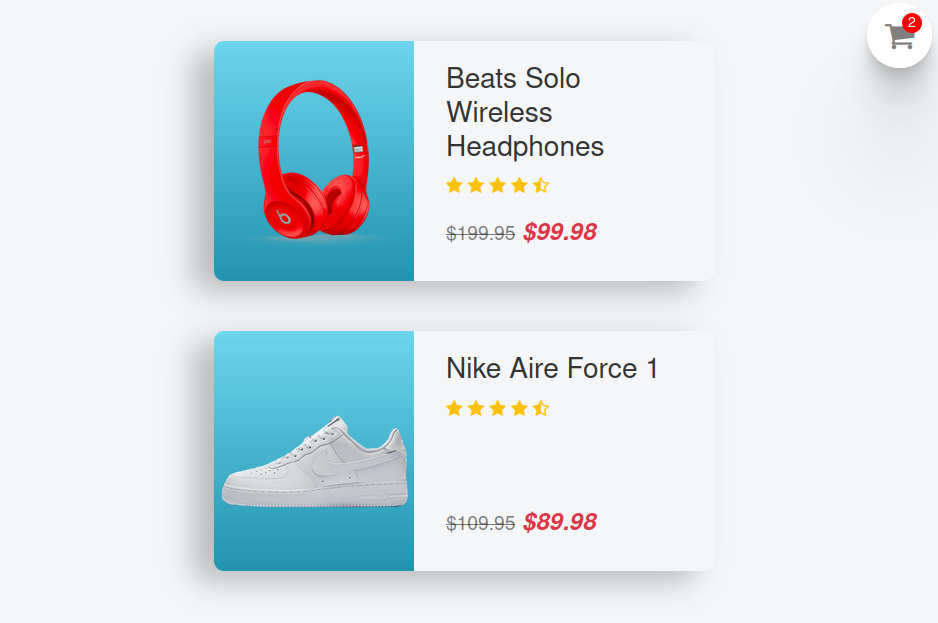
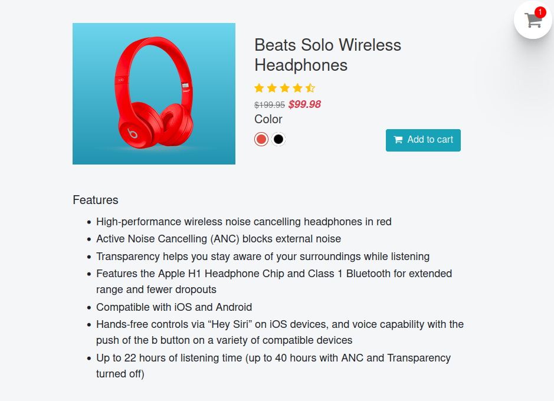
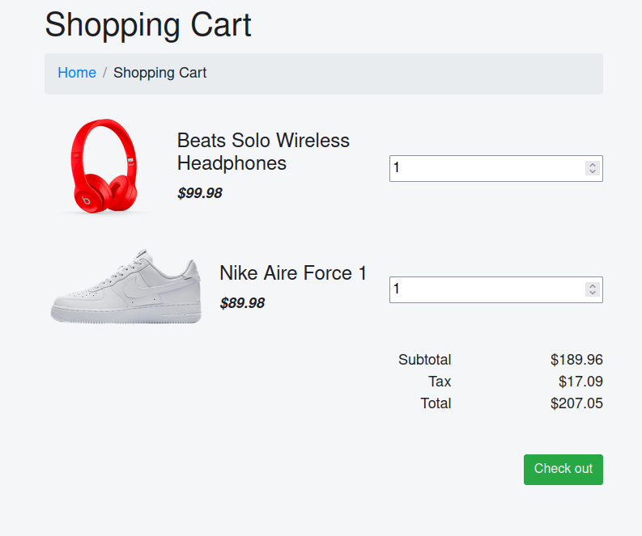

# Shopping Cart

## 💻 Projeto

Projeto desenvolvido com base nos videos [Ember.js tutorial for beginners in 2021][video], oferecido por [Shawn Chen][channel].

## 🛠 Tecnologias

As seguintes tecnologias foram utilizadas no desenvolvimento do projeto:

- [Ember][ember]

## 📷 Screenshots

<kbd>
  
</kbd>

<kbd>
  
</kbd>

<kbd>
  
</kbd>

[channel]: https://www.youtube.com/c/ShawnChenTech
[ember]: https://emberjs.com/
[video]: https://www.youtube.com/playlist?list=PLk51HrKSBQ88wDXgPF-QLMfPFlLwcjTlo
